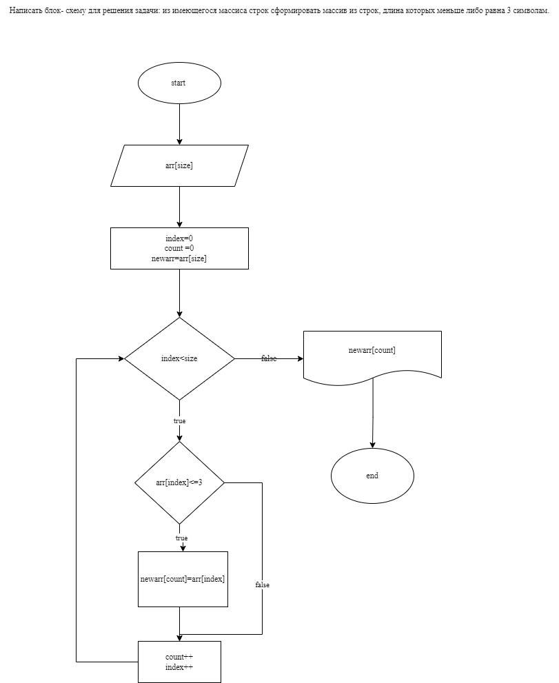

Задача :
*Написать программу, которая из имеющегося массива строк формирует массив из строк, длина которых меньше либо равна 3 символа. Первоначальный массив можно ввести с клавиатуры, либо задать на старте выполнения алгоритма. При решение не рекомендуется пользоваться коллекциями, лучше обойтись исключительно массивами*
# Описание работы программы
1. Работа  программы начинается с ввода  пользователем из клавиатуры массива строк.  
2. При помощи метода  
``` sh
  SecondArray
```
идет решение задачи .

Первым этапом задается   переменная   **count**
 и новый массив , длина которого изначально равна длине вводного массива.
 Затем  через цикл  **for**
определяются  элементы  нового  массива  путем  сравнения каждого элемента введеного массива  условием *( <=3 )* , если условие выполняется, то  элемент первого массива заносится в   *count*   как  элемент  нового массива. Цикл продолжается пока не будет пройден весь массив.

3. Итогом метода является формирование нового массива, состоящего из элементов, длина которых не более 3х символов.
4. Вывод сформированного массива происходит путем  метода **void**
``` sh
PrintArray
```

# Реализация программы 
Программа на языке  **C#**  в папке task1/Program.cs

# Блок схема програмы
 Блок- схема находистя  